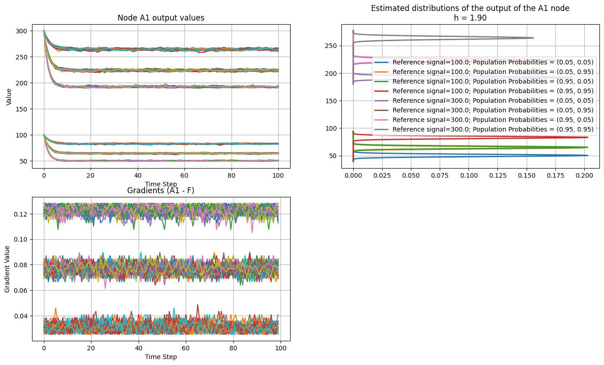

# interconnect

Humancompatible/Interconnect is an open-source toolkit for the modelling, simulations, and theorem proving for interconnections of ensembles.

## Functionality

---
Currently, toolkit allows to approximate the Contraction factor of the system with Stochastic approximation,
to check if Unique Invariant Measure exists, which is a prerequisite for Fairness. Then, it's possible
to estimate this unique invariant measure.

<div align="center">
    
</div>

<div align="center">
    
</div>

## Using HumanCompatible.Interconnect

---
1. Approximation of the Contraction factor of the iterated system:

```python
from tests.contractionTests.contraction_test import get_factor_from_list

C = get_factor_from_list(reference_signals=reference_signals,
                         agent_probs=np.array([[eps, 1-eps], [eps, 1-eps]]),
                         sim_class=Sim,
                         it=100,
                         trials=20,
                         weights="./weights/weights_basic_ReLU.pth",
                         node_outputs_plot="A1",
                         show_distributions_plot=True,
                         show_distributions_histograms_plot=False)
```

2. Approximating Unique Invariant Measure of the system:

```python
from humancompatible.interconnect.simulators.distribution import *
reference_signals = np.array([4, 5, 20, 25])

fig, ax = plt.subplots()
outputs = generate_outputs(sim_class=Sim,
                           weights="./weights/weights_basic_ReLU.pth",
                           reference_signals=reference_signals,
                           node="A1",
                           iterations=100,
                           samples=100)
distributions = get_distributions(x=outputs,
                                  h=1.9,
                                  labels=[f"reference_signal = {r}" for r in reference_signals],
                                  step=0.1,
                                  node="A1",
                                  show_plots=True,
                                  show_histograms=True,
                                  fig=fig,
                                  ax=ax)
```

### Examples
``examples/basic_simulation_ReLU`` - example notebook featuring the calls above.
Other example notebooks can be found in the same folder.

## Related work

---
For a background on the direction of research, see the AAMAS tutorial (https://humancompatible.org/index.php/2024/05/05/fairness-in-the-sharing-economy-and-stochastic-models-for-mas/), or the original papers:

arXiv:1807.03256 (https://arxiv.org/abs/1807.03256)
On the Ergodic Control of Ensembles
Andre R. Fioravanti, Jakub Marecek, Robert N. Shorten, Matheus Souza, Fabian R. Wirth
Comments: Journal version of Fioravanti et al. [arXiv:1703.07308, CDC 2017]
Journal-ref: Automatica, Volume 108, October 2019

arXiv:2007.16117 (https://arxiv.org/abs/2007.16117)
Predictability and Fairness in Social Sensing
Ramen Ghosh, Jakub Marecek, Wynita M. Griggs, Matheus Souza, Robert N. Shorten
Journal-ref: IEEE Internet of Things Journal, 2021

arXiv:2110.03001 (https://arxiv.org/abs/2110.03001)
Predictability and Fairness in Load Aggregation and Operations of Virtual Power Plants
Jakub Marecek, Michal Roubalik, Ramen Ghosh, Robert N. Shorten, Fabian R. Wirth
Journal-ref: Automatica, Volume 147, January 2023, 110743

arXiv:2112.06767 (https://arxiv.org/abs/2112.06767)
On the Ergodic Control of Ensembles in the Presence of Non-linear Filters
Vyacheslav Kungurtsev, Jakub Marecek, Ramen Ghosh, Robert N. Shorten
Journal-ref: Automatica, Volume 152, June 2023, 110946

arXiv:2104.14858 (https://arxiv.org/abs/2104.14858)
Unique Ergodicity in the Interconnections of Ensembles with Applications to Two-Sided Markets
Wynita M. Griggs, Ramen Ghosh, Jakub Marecek, Robert N. Shorten

arXiv:2209.01410 (https://arxiv.org/abs/2209.01410)
Closed-Loop View of the Regulation of AI: Equal Impact across Repeated Interactions
Quan Zhou, Ramen Ghosh, Robert Shorten, Jakub Marecek

The illustrative notebooks draw upon the code developed for the papers above by:

Wynita Griggs
Michal Roubalik
Matheus Souza
Quan Zhou
